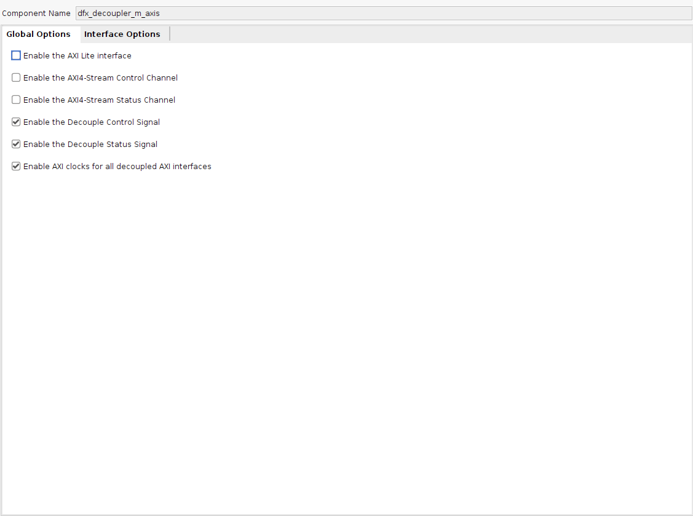
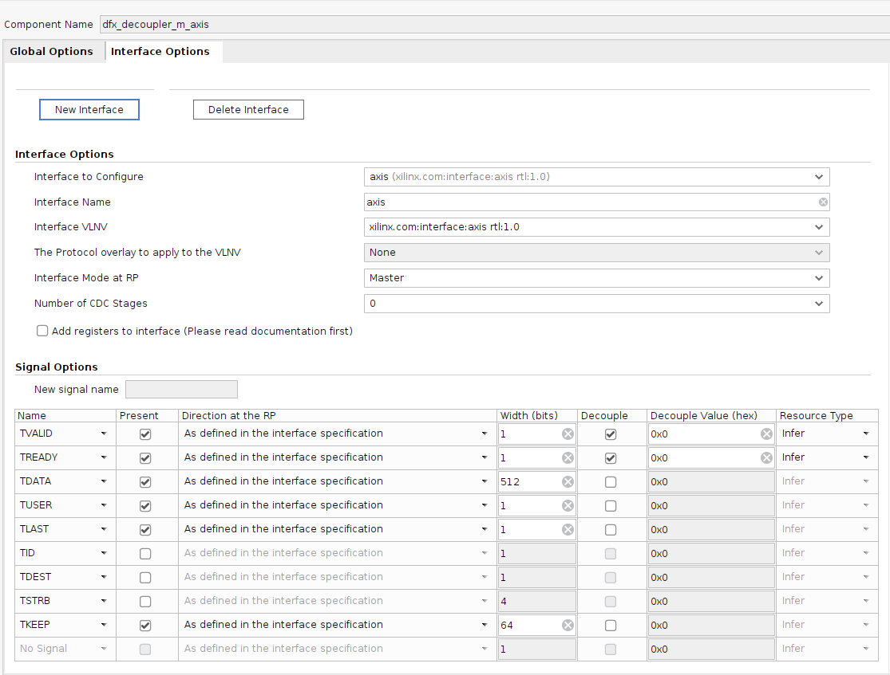

# Partial Reconfiguration Demo
This demo is built on and will assume familiarity with the [OpenNIC Shell](https://github.com/Xilinx/open-nic-shell/tree/main) and was implemented on an [Alveo U55C](https://www.xilinx.com/products/boards-and-kits/alveo/u55c.html), but can be implemented on other Xilinx programmable NICs. This demo also uses [pcimem](https://github.com/billfarrow/pcimem).

### Schematic


## Design Overview
This design is based off the default port-to-port implementation and creates a reconfigurable partition (middle_box) that sits between the incoming and outgoing traffic of the NIC. Three reconfigurable modules (pass_through, loopback, and hairpin) are implemented that handle this traffic in different ways. The pass_through module simply connects the incoming (rx path, highlighted purple) and outgoing (tx path, highlighted pink) traffic to the their respective other sides. When this module is loaded, the NIC behaves normally. The loopback module directs all transmitted data back to the NIC without putting it on the network by joining the transmit path to the receive path internally. Opposite this, the hairpin module first swaps the destination and source MAC address of incoming packets, then sends it out back onto the network without passing the packet to the CPU.

In order to decouple the AXI stream interfaces that carry the incoming and outgoing traffic to and from the RP, four DFX IP decouplers are used. These decouplers read from a control register presented by the register file to determine when to decouple the interface. Registers in the user logic box can be written to and read from using the AXI Lite interfaces (gold highlight) provided by the OpenNIC shell’s address mapping modules. The base address of the 322mhz logic box is 0x200000 and two registers are supported by this design:
- Address 0x200000: Decouple register. Write 1 to decouple the AXI stream interfaces from the RP, write 0 to allow traffic through the RP.
- Address 0x200004: Drop register. Write 1 to drop all incoming packets, write 0 to allow incoming packets.

Both registers are initialized to 0.

## Setup
The design is provided as a plugin to the OpenNIC shell and can be cloned from here. Similarly, the OpenNIC Shell should be cloned.

Once both repositories have been cloned, move to the script directory of the open-nic-shell repository and use either of the following commands as a template to create the vivado project. Feel free to adjust the -jobs or -board flags if you are using a different programmable NIC. The first does not begin synthesis immediately (-synth_ip 0), but simply generates the IP and a project file that can be opened in Vivado. The second begins synthesis and will not produce a project file until synthesis has successfully completed. It is recommended to use the first because synthesis of the shell's IPs could take some time and more will need to be added once the design is opened anyway. 

```shell:
#Make sure to use an absolute path for the pr-demo repo, it won't work otherwise
vivado -mode batch -source build.tcl -tclargs -user_plugin </absolute path/pr-demo> -synth_ip 0 -board au55c -jobs 32 -num_phys_func 2 -num_cmac_port 2

vivado -mode batch -source build.tcl -tclargs -user_plugin </absolute path/pr-demo> -board au55c -jobs 32 -num_phys_func 2 -num_cmac_port 2
```

## Add Sources
Add the following source files to the Vivado project from the pr-demo directory (you can use ctrl + click to select many items at a time):
- pass_through.sv
- register_file.sv

If you want to simulate the user box or register file in Vivado you can also add these other files from the pr-demo directory, but they are not necessary for implementation:
- axi_interfaces.sv
- box_tb.sv
- register_file_tb.sv

## Create DFX Decoupler IP
When using partial reconfiguration, it is important to consider what would happen if any signals arrived to or were spuriously generated by the RP during partial reconfiguration. To prevent these cases, something can be used to decouple the interface of the RP from the static logic while it is being reconfigured. This design uses the AMD DFX Decoupler IP to do so, though using AMD IP is not always strictly necessary. The design uses four decouplers, two decoupling the outgoing AXI stream interfaces of the middle box and two decoupling the incoming AXI stream interfaces of the middle box, so will require generating two decoupler IPs. The decouplers are already instantiated in p2p_322mhz.sv, but they still must be generated.

In the IP Catalog, locate the Dynamic Function eXchange folder and double click on the DFX Decoupler. Adjust the name, options, and interface to match those seen in the images below.

 

Repeat this process to generate the other IP, but use “dfx_decoupler_s_axis” for the name and for “Interface Mode at RP” select “Slave”. All other options are the same as those in the images above.

Once these have been created, the hierarchy of p2p_322mhz_inst should show four decouplers with the IP mark beside them. Two with the name “dfx_decoupler_s_axis” and two with the name “dfx_decoupler_m_axis”. If you see question marks beside these, the IP could have been generated incorrectly.

Prompts will appear to begin synthesis of the IP, choose to do so out-of-context, which should be the default.

## Setup Partial Reconfiguration
### Enable DFX
DFX can be enabled in a project by selecting “Tools>Enable Dynamic Function eXchange” from the toolbar at the top of the window. As of Vivado 2023.2, **this is a one way transition** that will make [simulation impossible via the GUI](https://docs.amd.com/r/en-US/ug909-vivado-partial-reconfiguration/Simulation-and-Verification) and not allow the [netlist insertion debug flow](https://docs.amd.com/r/en-US/ug908-vivado-programming-debugging/Using-the-Netlist-Insertion-Debug-Probing-Flow) (i.e. predominantly GUI ILA setup). It may be advisable to create a copy of the repository/sources/project file without DFX enabled before continuing for this reason.

### Define Reconfigurable Partitions
The first step in working with partial reconfiguration is to define your reconfigurable partition. A reconfigurable partition defines the point in the design hierarchy that is to be reconfigurable while not actually specifying any implementation for that region. A reconfigurable partition does not allow the top level module to be parameterized or to be IP. To create a reconfigurable partition, navigate through the source hierarchy, select the point where partial reconfiguration should be used, then left click and choose “Create Partition Definition”. Follow the steps outlined by the wizard to give a name to the reconfigurable partition and a name for the first reconfigurable module. The name for this reconfigurable module can be anything, but it may be more clear for now if it corresponds to the module name that was chosen when creating the reconfigurable partition.

Once a reconfigurable partition has been created, the blue circle beside the module name should become a gold diamond. Additionally, a new “Partition Definitions” tab should appear in the sources window (inline with the Hierarchy, IP Sources, etc.). Source files that lie within the reconfigurable partition will now be visible in this tab under their corresponding RP and RM.

As many RP can be created in this manner as necessary, each will gain the chosen point in the hierarchy as its first RM.

Mark the “genblk1[0].pass_through_inst” or “genblk1[1].pass_through_inst” modules in the hierarchy as reconfigurable partitions using “middle_box” as the name when prompted for “Partition Definition Name”. Vivado will realize that both of these instances use the same RP and mark both accordingly.

### Add Reconfigurable Modules
Add the “loopback.sv” and “hairpin.sv” files (in the pr-demo repository)  as individual RMs for the middle_box RP.

Reconfigurable modules are the units that are swapped in and out of reconfigurable partitions. Each reconfigurable partition can have many reconfigurable modules that implement different logic within the same physical block on the FPGA. While the logic can be different, it is important that each reconfigurable module has the same interface as the others. The effect is that the reconfigurable partition should have a consistent interface regardless of the RM implemented in it.

Reconfigurable modules can be added to reconfigurable partitions in at least two ways.

#### Adding Reconfigurable Modules from the Partition Definitions Tab
1. Navigate to the Partition Definitions tab
2. Left-click the RP you wish to add an RM to and select “Add Reconfigurable Module”
3. Use the wizard to select the source file for the RM and the name. Options are similar to those when adding a source file to a static portion of the design.

#### Adding Reconfigurable Modules from the DFX Wizard
1. Click “Dynamic Function eXchange Wizard” under the Project Manager group of the Flow Navigator
2. Click “Next” to get to the RM configuration page
3. Click the blue plus button
4. Use the wizard to select the RP, source file for the RM, and the name. Options are similar to those when adding a source file to a static portion of the design.

### Create Configurations and Implementation Runs
Use the DFX wizard to setup the configurations and implementation runs for the design. Recommended to use the automatic options when possible and the standard implementation mode, but it is okay to experiment if you want.

The DFX Wizard can be used to add reconfigurable modules, configurations, and implementation runs. Adding reconfigurable modules using the wizard is covered above. Configurations describe the whole implementation of the target, including static and dynamic logic with one RM implementing each RP. Implementation runs can be created for each configuration. Once all changes have been made in the DFX Wizard, use the finish button to save them. Changes can be abandoned by clicking cancel.

#### Creating Configurations
1. Open the DFX Wizard and navigate to the configuration page
2. Automatically create the minimum set of configurations by clicking the indicative blue text; this will create configurations such that an RP is implemented by each of its RMs in at least one configuration OR manually create configurations using the blue plus button and selecting the RM to implement each RP for that configuration

#### Creating Implementation Runs
1. Open the DFX Wizard and navigate to the configuration runs page

2. Choose to automatically create the runs for corresponding configurations created earlier by clicking the indicative blue text OR manually create implementations by selecting the parent synthesis/implementation, DFX mode, and configuration for the implementation. 
    - Standard mode will create a full implementation for each configuration along with the partial implementations of the RMs implemented in that configuration
    - Abstract Shell mode creates partial implementations of RMs in RPs using an abstract shell (minimized static logic) as the base of the design

## Synthesize
You can now proceed to synthesize the design. Some of the IP may take a long time to synthesize, so feel free to look over and get an understanding of the design in the mean time.

## Floorplanning
Follow along with this guide to (hopefully) get a successful implementation first time, but also don’t be afraid to try new pblock locations or mess around a little with the plbock settings to find out more about what does or does not work. And definitely make sure to check out the resource utilization of your RP in those modules as well. However, note the existing pblocks used created for the OpenNIC shell.

1. Follow the guide to create a pblock for “genblk1[0].pass_through_inst”. My pblock for this RP encompasses the X1Y7 clock region on the Alveo U55C.
2. Similarly create a pblock for  “genblk1[1].pass_through_inst”. My pblock for this RP encompasses the X1Y6 clock region.

Once your pblocks have been created and associated with the RPs, make sure to save the project with the save button.

### Viewing the Floorplan
1. Use the Flow Navigator to open the synthesized design
2. Change to the Floorplanning layout using the toolbar at the top of the window

This floorplanning layout will add a “Physical Constraints” tab from which the details of the design’s pblocks can be analyzed and will also display a diagram with components of the device. Take some time to analyze this diagram and get familiar with the environment. If your design already has Pblocks, which appear as magenta rectangles, take note of these and the modules that they encapsulate, which should appear as brown boxes within the pblock.

### Drawing and Assigning Pblocks
#### Using the Netlist Hierarchy
Left click on the module in the netlist hierarchy that corresponds to the desired RP and choose “Floorplanning>Draw Pblock”. The cursor should now be a crosshair when placed over the design diagram. Click and drag to draw pblock rectangle.

Once a block has been drawn, follow the instructions from the wizard to name the pblock and it should appear within the “Physical Constraints” tab. By clicking on (or left clicking and selecting “Pblock Properties”) the statistics and resources of that pblock can be used. This is helpful in determining if your pblock will have enough resources to accommodate all of your RMs for a particular RP.

#### Using the “Draw Pblock” Button from the Diagram View
Just above the diagram there should be a toolbar that has a button that looks like “P+”. Click this button to enable pblock drawing and move the cursor over the diagram; it should now appear as a crosshair. Click and hold to draw a pblock rectangle onto the diagram. Any resources fully within the drawn box will become associated with that pblock.

Once a block has been drawn, follow the instructions from the wizard to name the pblock and it should appear within the “Physical Constraints” tab. By clicking on (or left clicking and selecting “Pblock Properties”) the statistics and resources of that pblock can be used. This is helpful in determining if your pblock will have enough resources to accommodate all of your RMs for a particular RP.

To assign an RP to the pblock, left click on the module in the netlist hierarchy that corresponds to the desired RP and choose “Floorplanning>Assign to Pblock”.

## Implementation
Once all floorplanning and other steps have been done, start implementation of the design. The design for config_1 will begin first and when it is done, the other two implementations for config_2 and 3 will begin in parallel. This could take some time, so look back at the design section to get familiar with the design if you want.

## Programming a Device
When implementation is complete and timing constraints are satisfied, generate the bitstreams for the device in the usual manner. Partial bitstreams for each RM will automatically be created along with full bitstreams for each configuration. 

### Programming Full Bitstream
Program the device with one of the full bitstreams generated from the impelementation runs. Pass_through, i.e. config_1, is recommended so that ping testing can be done by default. Please refer the [OpenNIC Shell](https://github.com/Xilinx/open-nic-shell/tree/main) to figure out the best way to program your device.

### Programming Partial Bitstream
Before sending a partial bitstream to the device, use [pcimem](https://github.com/billfarrow/pcimem) to write a 1 to the decoupler register in the 322mhz logic box. More info on using pcimem to write to the OpenNIC shell can be found in the [OpenNIC Driver](https://github.com/Xilinx/open-nic-driver) repository. When using pcimem, you will see the value written, but the readback value probably will not show the update. This could be due to a bug in the register file and how the OpenNIC shell reads registers using the AXI Lite interface. This should not impact the functionality of the register though, and this can be tested by pinging from one server to another; no traffic should pass when the RPs are decoupled.
```shell:
#In the pcimem directory
#Decouple the RPs
sudo ./pcimem <path to device resource> 0x200000 w 0x1
```
To program a partial bitstream , use Vivado as normal and select a partial bitstream for the RP that corresponds to the port that you are testing on. Once the bitstream is programmed, reopen the middle box by writing a 0 to the decouple register.
```shell:
#Reopen RPs
sudo ./pcimem <path to device resource> 0x200000 w 0x0
```
The traffic should now behave according to the implementation of the installed RM. Congratulations!